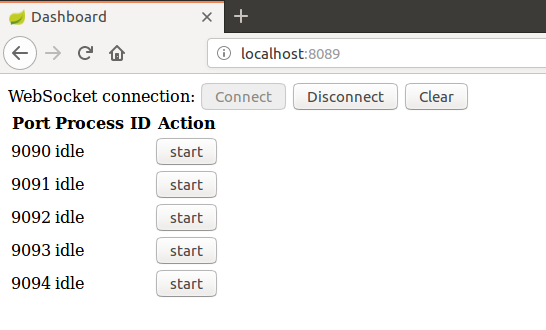
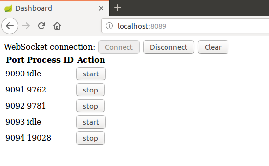
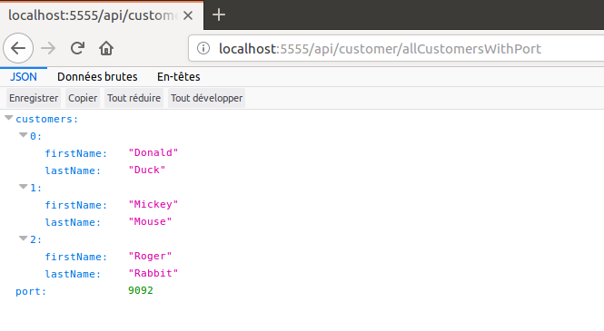

# tiergarten-watch
I present here a microservice-oriented demo of basic ZooKeeper functions. A dashboard allows to stop and start instances of a service.

Here are the prerequisites for running the complete application:

A recent Linux version (I used Ubuntu 16.04)

A recent Apache Maven version installed (I used 3.3.9)

A recent Zookeeper version installed (I used 3.4.8-1--1)

# 1. Creating a JAR file

In subdirectory customer-server run the command:

```
mvn clean package
```

It creates a runnable JAR file named customer-server-0.0.1-SNAPSHOT.jar. It will be used by the shell script launch.sh.

# 2. Starting main processes

In each of the subdirectories:

confsvr
cluster-monitor
eureka-service
tiergarten-gateway

run the command:

```
mvn spring-boot:run
```

Always begin with confsvr and wait for confsvr up and running before starting the other processes that all depend on confsvr to load their properties.

Then connect to dashboard on localhost:8089. It will return a display like:



Start some processes by clicking the Start buttons. Wait to see the process Id appear like on this screen shot:



Then open a new browser window and enter URI:

```
localhost:5555/api/customer/allCustomersWithPorts
```
It will return a display like:



Note that for each update the port number changes in a round-robin way. Customer-server is a dummy server that display always the same response except for port number.

To stop a process click the Stop button.

Note that all customer server processes created keep running even if cluster-monitor itself is terminated.


